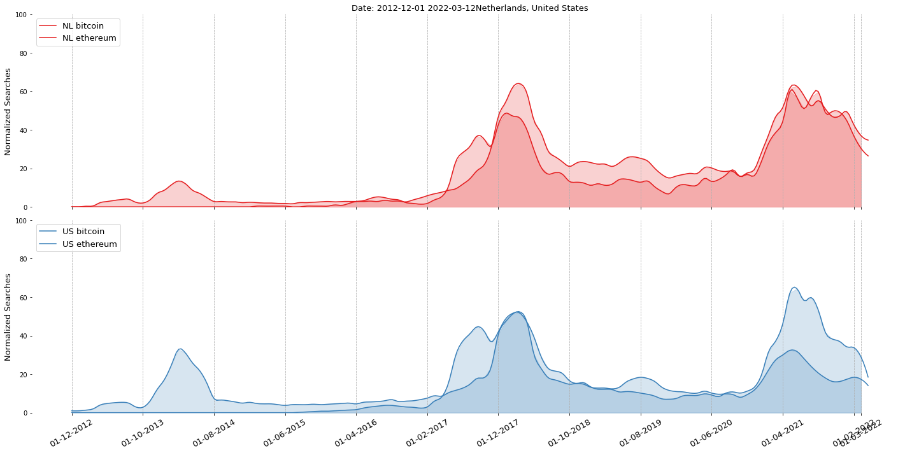
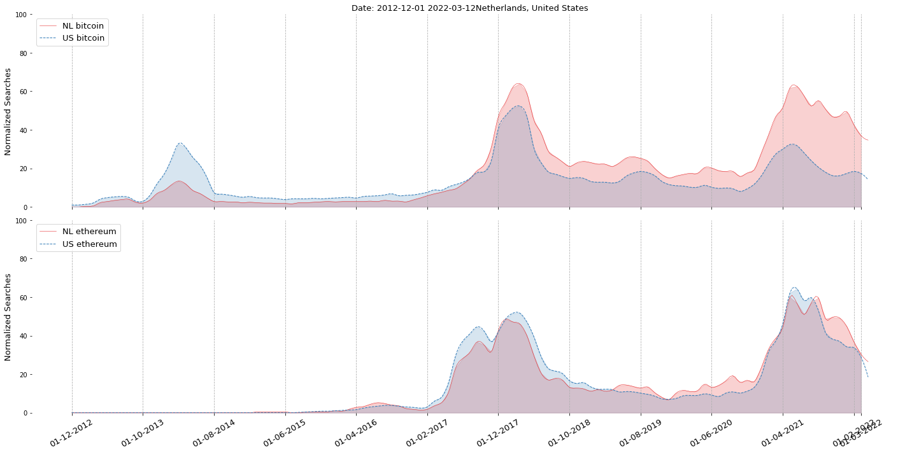
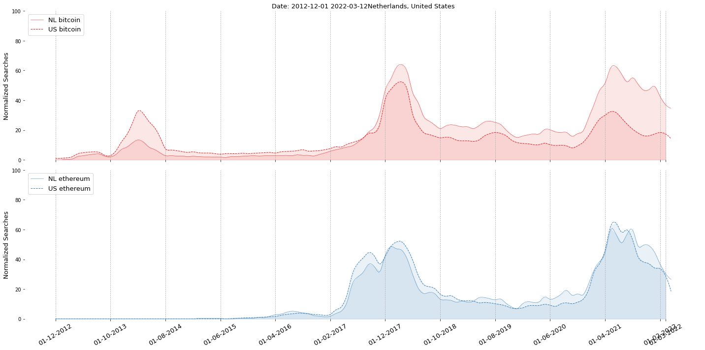
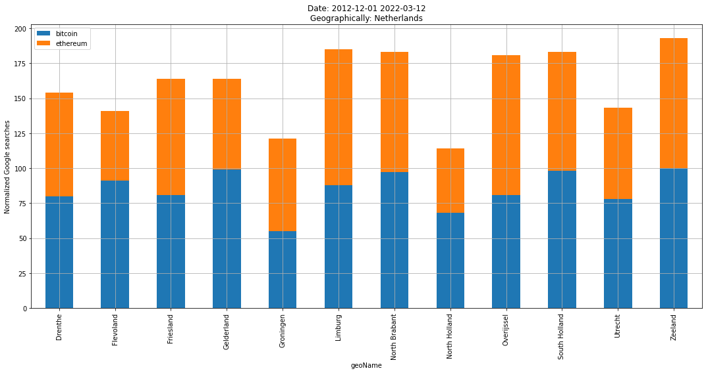
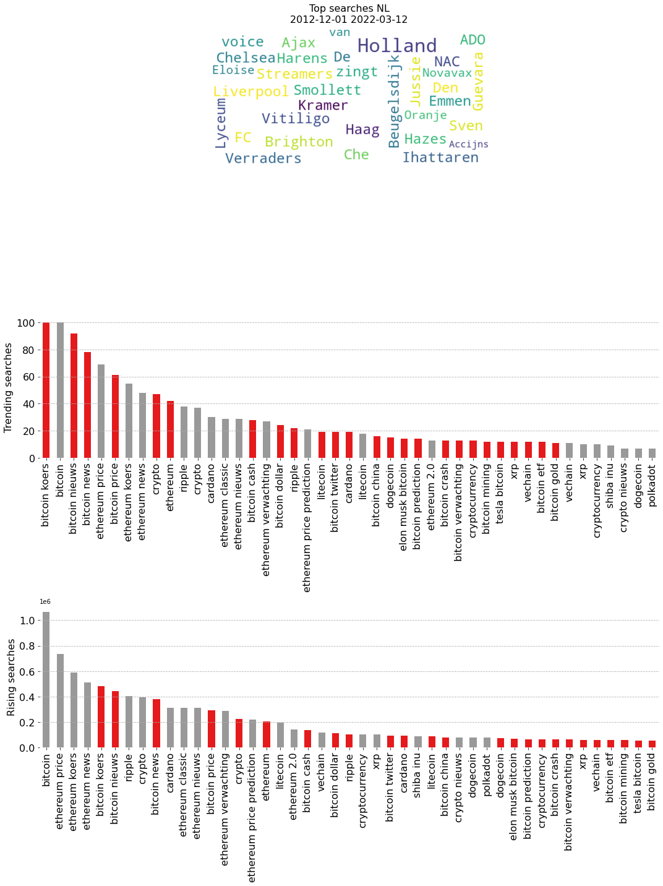

Get country names and abbrevations
####################################

The country name is required for the majority of fucntions. Here we will demonstrate how to view all 255 available countries that can be used to analyze trends.

.. code:: python

	# Import
	import googletrends as googletrends

	# Get country names
	geo_names = googletrends.get_geo_names()
	print(geo_names)

	#     code               country
	# 0     AD               andorra
	# 1     AE  united arab emirates
	# 2     AF           afghanistan
	# 3     AR             argentina
	# 4     AO                angola
	# ..   ...                   ...
	# 251   YE                 yemen
	# 252   YT               mayotte
	# 253   ZA          south africa
	# 254   ZM                zambia
	# 255   ZW              zimbabwe

Analyze Timewise
####################################

In this example multiple searchwords are examined for multiple countries over time. Countries can be in the form of their abbrevation or country name. The until date is not given and automatically set on today.

.. code:: python

	# Import
	import googletrends as googletrends

	# Settings
	searchwords = ['bitcoin', 'ethereum']
	geo = ['NL', 'united states']
	date_start = '01-12-2012'
	
	# Collect the google trends since 2012
	results = googletrends.temporal(searchwords, geo=geo, date_start=date_start)

	# [googletrends] Collecting trends over time for geographically: ['NL', 'US']
	# [googletrends] 01 December 2012 - 12 March 2022
	# [googletrends] [NL] Working on bitcoin..
	# [googletrends] [NL] Working on ethereum..
	# [googletrends] [US] Working on bitcoin..
	# [googletrends] [US] Working on ethereum..

	# Plot
	googletrends.plot(results)

.. |fig1| image:: ../figs/bitcoin_temporal.png

.. table:: google trends since 2012 for bitcoin and ethereum across the countries NL and US.
   :align: center

   +----------+
   | |fig1|   |
   +----------+

Analyze Timewise with groupby
######################################################

The plot can be created in various manners, by using different groupby's and coloring on searchwords.
Let's see what happens if use other groupings and coloring.

.. code:: python

	googletrends.plot(results, color_by_searchword=True, group_by_searchword=False)
	googletrends.plot(results, color_by_searchword=False, group_by_searchword=False)
	googletrends.plot(results, color_by_searchword=False, group_by_searchword=True)
	googletrends.plot(results, color_by_searchword=True, group_by_searchword=True)

.. table:: Four different plots for google trends.
   :align: center

   +----------+
   | |fig1|   |
   +----------+
   | |fig2|   |
   +----------+
   | |fig3|   |
   +----------+
   | |fig4|   |
   +----------+

Analyze Geographical
####################################

In this example multiple searchwords are examined across multiple countries. The input for a country can be in the form of the abbrevation or country name. All frequencies are summarized into one value between the start-stop date.

.. code:: python

	# Import
	import googletrends as googletrends

	# Settings
	searchwords = ['bitcoin', 'ethereum']
	geo = ['NL', 'united kingdom']
	date_start = '01-12-2012'
	
	# Collect the google trends since 2012
	results_spatio = googletrends.spatio(searchwords, geo=geo, date_start=date_start)

	# [googletrends] 01 December 2012 - 12 March 2022
	# [googletrends] [NL] Working on bitcoin..
	# [googletrends] [NL] Working on ethereum..
	# [googletrends] [GB] Working on bitcoin..
	# [googletrends] [GB] Working on ethereum..

	# Plot
	googletrends.plot(results_spatio)

.. |fig6| image:: ../figs/bitcoin_geo_UK.png
.. |fig7| image:: ../figs/bitcoin_geo_NL.png
.. |fig8| image:: ../figs/bitcoin_geo_UK1.png
.. |fig9| image:: ../figs/bitcoin_geo_worldmap.png

.. table:: Google search per country and per searchword.
   :align: center

   +----------+----------+
   | |fig5|   | |fig6|   |
   +----------+----------+
   | |fig7|   | |fig8|   |
   +----------+----------+
   |        |fig9|       |
   +----------+----------+

Analyze Trends
####################################

In this example multiple searchwords at multiple geographical locations are examined for trending searches.
All frequencies are summarized into one value between the start-stop date.

.. code:: python

	# Import
	import googletrends as googletrends

	# Settings
	searchwords = ['bitcoin', 'ethereum']
	geo = ['NL', 'united kingdom']
	date_start = '01-12-2012'
	
	# Analyze the trends for the searchwords
	results_trending = googletrends.trending(searchwords, geo=geo, date_start=date_start)
	googletrends.plot(results_trending)

	# --------[NL]--------
	# [bitcoin]
	#    Top: 25
	#    Rising: 25
	#    Trending: 20
	# [ethereum]
	#    Top: 20
	#    Rising: 20
	#    Trending: 20

.. table:: google trends.
   :align: center

   +----------+
   | |fig10|  |
   +----------+

.. raw:: html

	

	

		
	

	

