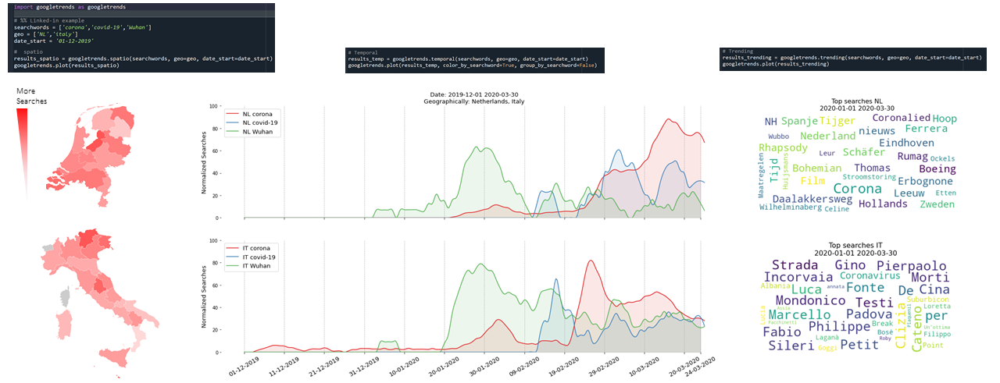

googletrends's documentation!
==============================

|python| |pypi| |docs| |stars| |LOC| |downloads_month| |downloads_total| |license| |forks| |open issues| |project status| |repo-size| |donate|

.. include:: add_top.add

.. table::
   :align: center

   +----------+
   | |fig1|   |
   +----------+

``googletrends`` is Python package to examine trending google searches on geographical location and across time for input keywords. It will summarize the results per country/region and/or per time-frame and with(out) a specific keyword. 
``googletrends`` uses the trending information on spatio and temporal space for input queries. Data is al arround us. Some data is easy to get, others not. Especially when it comes to what people are "thinking" related to an issue/brand/company can be though. However, the "thinking" process can supported by googling about the subject. So if we know what people are searching for, it can give insights in the "common" thoughts. 

There are three main functionalities to reveal insights in the topics of interest:

* Search Timewise (Temporal)
* Search Geographically (Spatio)
* Search Trending

-----------------------------------

.. note::
	**Your ❤️ is important to keep maintaining this package.** You can `support <https://erdogant.github.io/classeval/pages/html/Documentation.html>`_ in various ways, have a look at the `sponser page <https://erdogant.github.io/classeval/pages/html/Documentation.html>`_.
	Report bugs, issues and feature extensions at `github <https://github.com/erdogant/googletrends/>`_ page.

	.. code-block:: console

	   pip install googletrends

-----------------------------------

Content
=======

.. toctree::
   :maxdepth: 1
   :caption: Installation
   
   Installation

.. toctree::
  :maxdepth: 1
  :caption: Tutorials

  Tutorials

.. toctree::
  :maxdepth: 1
  :caption: Examples

  Examples

.. toctree::
  :maxdepth: 1
  :caption: Documentation
  
  Documentation
  Coding quality

* :ref:`genindex`

Indices and tables
==================

* :ref:`genindex`
* :ref:`modindex`
* :ref:`search`

.. |python| image:: https://img.shields.io/pypi/pyversions/googletrends.svg
    :alt: |Python
    :target: https://erdogant.github.io/googletrends/

.. |pypi| image:: https://img.shields.io/pypi/v/googletrends.svg
    :alt: |Python Version
    :target: https://pypi.org/project/googletrends/

.. |docs| image:: https://img.shields.io/badge/Sphinx-Docs-blue.svg
    :alt: Sphinx documentation
    :target: https://erdogant.github.io/googletrends/

.. |stars| image:: https://img.shields.io/github/stars/erdogant/googletrends
    :alt: Stars
    :target: https://img.shields.io/github/stars/erdogant/googletrends

.. |LOC| image:: https://sloc.xyz/github/erdogant/googletrends/?category=code
    :alt: lines of code
    :target: https://github.com/erdogant/googletrends

.. |downloads_month| image:: https://static.pepy.tech/personalized-badge/googletrends?period=month&units=international_system&left_color=grey&right_color=brightgreen&left_text=PyPI%20downloads/month
    :alt: Downloads per month
    :target: https://pepy.tech/project/googletrends

.. |downloads_total| image:: https://static.pepy.tech/personalized-badge/googletrends?period=total&units=international_system&left_color=grey&right_color=brightgreen&left_text=Downloads
    :alt: Downloads in total
    :target: https://pepy.tech/project/googletrends

.. |license| image:: https://img.shields.io/badge/license-MIT-green.svg
    :alt: License
    :target: https://github.com/erdogant/googletrends/blob/master/LICENSE

.. |forks| image:: https://img.shields.io/github/forks/erdogant/googletrends.svg
    :alt: Github Forks
    :target: https://github.com/erdogant/googletrends/network

.. |open issues| image:: https://img.shields.io/github/issues/erdogant/googletrends.svg
    :alt: Open Issues
    :target: https://github.com/erdogant/googletrends/issues

.. |project status| image:: http://www.repostatus.org/badges/latest/active.svg
    :alt: Project Status
    :target: http://www.repostatus.org/#active

.. |donate| image:: https://img.shields.io/badge/Support%20this%20project-grey.svg?logo=github%20sponsors
    :alt: donate
    :target: https://erdogant.github.io/googletrends/pages/html/Documentation.html#

.. |repo-size| image:: https://img.shields.io/github/repo-size/erdogant/googletrends
    :alt: repo-size
    :target: https://img.shields.io/github/repo-size/erdogant/googletrends

.. include:: add_bottom.add
